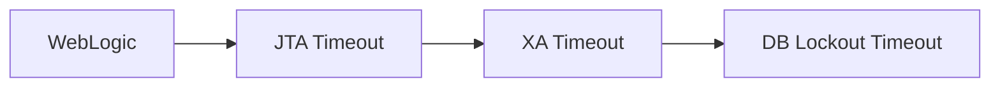

---
**Contents**
* TOC
{:toc}
---

# 1. 개요

2019년 02월 고객사 일부 장애 건 정리.


---

# 2. 현상

웹로직 서버로그에는 나오지 않으나...

어플리케이션 노헙 로그에서는 아래와 같은게 발견된 적이 있다.

```
XAConnection java.sql.SQLException: XA error: XAResource.XAER_RMFAIL start() failed on resource
```


---

# 3. 해결

오라클 문서에서 가이드 하는 내용은.

- DB 쪽에 maximum process 확인.
- DB init.ora의 DISTRIBUTED_LOCKOUT 값 확인.


이중 LOCKOUT은 기본값 60초이며,

DB를 insert,delete,update 등으로 사용자가 점유하고 있으면, table lock을 걸어두고 사용해야 한다.

이 lock을 기다리는 최대 시간을 의미하는 것으로 보여진다.

웹로직 에서 DB까지의 흐름을 보면

<div class="mermaid">
    graph LR;
    WebLogic --> JTA[JTA Timeout];
    JTA --> XA[XA Timeout];
    XA --> DB[DB Lockout Timeout];
</div>




JTA timeout : 웹로직에서 트랜잭션 전체 크기에 해당하는 time만큼 지정해야 한다. 클라이언트가 결과를 받을 때까지를 의미하기 때문에, DB단까지 포함해야 한다.

XA timeout : XA 로직 실행 타임아웃.

LOCKOUT : DB Table lock 대기 시간.

나도 헷갈려서 정리를 나중에 다시 해야겠는데..

어쨋든.. LOCKOUT이 실제 업무 타임보다 짧아, 기본값 60초만 기다리고 업무를 보지 못하고 rollback 되는 경우가 있다는 것 같다;;