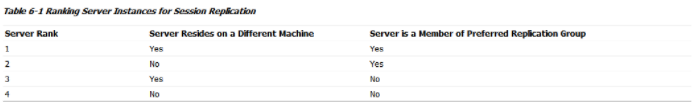
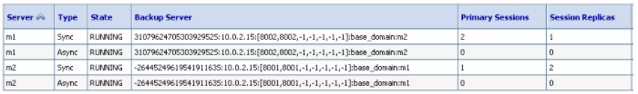
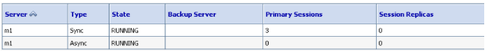
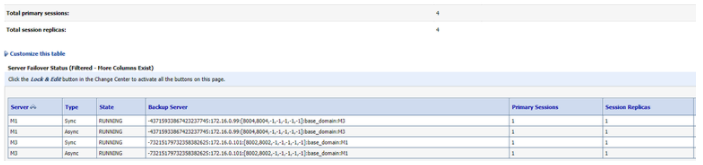
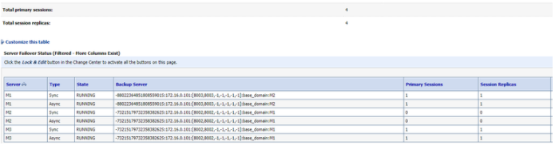
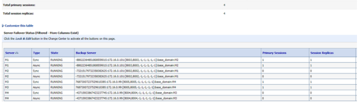

---
**Contents**
* TOC
{:toc}
---

# 1. 개요

WebLogic Cluster 의 Session 복제 조건을 알아본다.

# 2. Session Replication 대상

- 사용자가 was1번에 접속 시, 이를 Primary Server라 하며 Session을 생성.
- Primary Server에 생성된 Session Backup을 Secondary Server에 복제.
- Secondary Server는 같은 Cluster내 Member중 Random하게 하나를 선택.
  - 말이 랜덤이지, 기준이 있다 (웹로직만의 기준). 아래 그림.

- Primary Server가 shutdown 되더라도, Secondary Server에 backup 본이 있음. -> Failover

# 3. Session Replication 조건

Session 생성은 HttpSession.setAttribute() method으로 실행됨.

즉, 사용자의 Request가 있다고 Session Trigger(간단한 의미로 Session이 유효한지)등은 Page 새로고침(F5)만으로 발생하는 것이 아니라 해당 Page에 setAttribute()가 있어야 함.

Primary Server의 shutdown이 되더라도, Secondary Server에 backup Session이 남아있지만,

더이상 사용자의 Request로 인해 setAttribute()를 호출하지 않으면, 해당 Session은 Secondary Server에만 존재하지 Primary Server가 없는 상황이 발생.

또한, 다음 표는 Cluster 내 Member들 간 Session 복제 우선 순위.

1순위 - 다른 머신, 같은 그룹

2순위 - 같은 머신, 같은 그룹

3순위 - 같은 머신, 다른 그룹

4순위 - 다른 머신, 다른 그룹

머신은 이중화 장비를 의미. 그룹은 Console - Servers - <instance> - Configuration - Cluster에서 Replication Group으로 지정한다. 사실, 복잡한 시스템 또는 특별한 요구사항이 없다면 일반적으로 신경쓰지 않는다.

# 4. Instance Shutdown 시에 Primary와 Secondary Session 이동

m1에 Primary 2, Secondary 1

m2에 Primary 1, Secondary 2

m2 instance를 shutdown 시에,

m1의 Secondary가 m1의 Primary로 이동한다.

# 5. 로컬에서 Replication Group 테스트

테스트 목적 : 클러스터링 세션의 Primary, Secondary 구성의 여러가지 테스트.

환경 : Machine1과 Machine2 는 물리적으로 서버가 다르다.

Machine1 에는 인스턴스 M1, M2 를 묶어 띄웠고,

Machine2 에는 인스턴스 M3, M4 를 묶어 띄웠다.

M1, M2, M3, M4 는 Clustering 되었다.

===== WLS =========================

AdminServer - 172.16.0.101

---- Clustering ----

Machine1 (M1, M2) - 172.16.0.101

Machine2 (M3, M4) - 172.16.0.99

\--------------------

===================================

웹로직 기본 알고리즘에 의하면, 다음과 같이 클러스터링 순서가 정해짐.

M1 - M3

M2 - M4

M3 - M1

M4 - M2

\* 기동 순서에 따라 약간의 차이는 있지만, 대체로 조건표에 부합됨.

Replication Group을 아래와 같이,

M1 (Replication Group : M1) , (Preferred Secondary Group : M2)

M2 (Replication Group : M2) , (Preferred Secondary Group : M1)

M3 (Replication Group : M3) , (Preferred Secondary Group : M4)

M4 (Replication Group : M4) , (Preferred Secondary Group : M3)

주게 되면

M1 - M2

M2 - M1

M3 - M4

M4 - M3

와 같이 설정이 강제로 된다.

조건표 무시하고, 직접 선호도를 설정 가능.

다만, 동시 기동하여야 선호하는 그룹으로 설정이 가능하다.

\* Replication Group : 나의 그룹명

\* Preferred Secondary Group : 선호하는 세컨드리 인스턴스의 그룹명

# 6. 로컬에서 Replication Group 테스트 - #2

위 테스트에서, Replication Group, Preferred Group 을 설정하여도

기동 순서에 따라서, 원하지 않는 순서로 맺어지는 줄 알았는데..

기동 할 때마다 조건에 부합되도록 클러스터 구성을 재조정 하고 있다.

내가 설정한 조건대로라면,

M1 - M2

M2 - M1

M3 - M4

M4 - M3 으로 클러스터 Primary/Secondary 설정이 되어야 하는데

이 기동순서를 조정하여 다음과 같이 조건에 맞지 않게 붙게 하였다.

그림1. M1 , M3 인스턴스만 기동하여 서로 강제 클러스터링

그림2. M2 인스턴스를 추가 기동하였더니, 클러스터 구조 재조정

그림3. M4 인스턴스를 추가 기동하였더니, 클러스터 구조 재조정

클러스터 구조가 재조정되며, 세션이 이동된다.

상당히 무거운 시스템에서는 이러한 재조정 사태에 부하가 발생할 것 같은데..

관련 내용은 오라클 문서에서 찾지 못했다.

