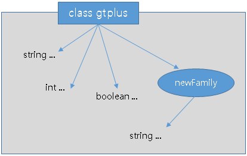
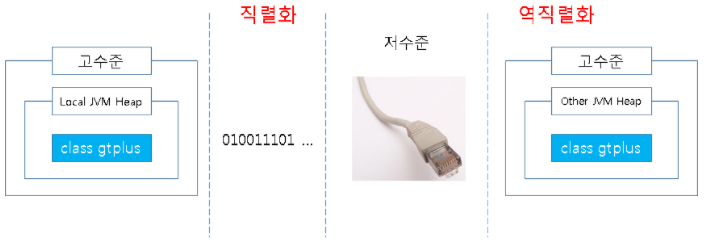

---
**Contents**
* TOC
{:toc}
---

# 1. 개요

Serializable 란 무엇인가?


# 2. 바이트 스트림(Byte Stream)

통신(네트워크, 입출력I/O)은 바이트 단위로 이루어 집니다.

그리고 이 통신을 스트림 이라고 합니다.

즉, 통신은 바이트 스트림으로 이루어진다고 할 수 있습니다.


# 3. 고수준과 저수준

그리고 이때 통신은 하드웨어적인 저수준과, 소프트웨어적인 고수준으로 구분할 수 있습니다.

고수준 통신을 사용하는 소프트웨어에서 문자 "a"를 전송하기 위해서는 저수준인 1바이트 0110 0001로 하드웨어에 전달해야 합니다.

여기서 하드웨어는 이더넷 케이블이나 랜카드, 라우터 등을 의미합니다.


# 4. 객체는 그래프

integer, byte, long, boolean, string, char 와 같은 데이터들은 바이트 단위로 이루어져 있기 때문에 통신에서 걱정할 필요가 없습니다.

하드웨어에서 금방 이해할 수 있는 저수준으로 이루어져 있기 때문입니다.

하지만 객체는 구조가 달라 일반적으로 통신에 사용할 수 없습니다.

가령 클래스 객체는 그래프라는 형식으로 이루어져 있습니다.

예로 아래 클래스 gtplus는 몇개의 변수들과 메서드를 가지고 있습니다.


```java
class gtplus{
     string ...;
     int ...;
     boolean ...;
     
     public newFamily(){
          string ...;
     }
}
```


그래프는 다음과 같습니다.



클래스 내의 string, int 등은 통신에서 보낼 수 있지만, 클래스 객체는 연결고리(레퍼런스)가 그래프 형식이기 때문에 정리할 필요가 있습니다.


# 5. Serializable

여기서 정리를 위해 바이트 단위처럼 일렬로 만드는 직렬화가 필요합니다.

JDK 1.1에서 나온 직렬화는 단순히 인터페이스를 구현(implements Serializable)하는 것으로 직렬화가 됩니다.

원래 그렇듯이 인터페이스 내부에는 아무런 기능도 없지만, JVM에서 이해하고 자동으로 OS에 특화된 저수준 통신에 사용할 수 있게 바꾸어 주기 때문입니다.

또 객체를 전달받은 JVM은 역직렬화를 통해 저수준의 객체 데이터를 고수준으로 바꾸어 원래의 객체 상태로 완전히 복구하여 사용할 수 있게 됩니다.

직렬화를 요약하자면, 객체를 전송(파일 저장, 네트워크 통신)하기 위해 그래프를 일렬로 줄 세운다고 할 수 있습니다.





# 6. RMI

직렬화 하면, RMI 통신과 연관되어 있습니다.

Remote Method Invocation은 원격 메소드 호출으로써, 자바 환경에서 다른 JVM(다른 서버)의 메모리에 적재되있는 객체를 불러 마치 로컬에 구현한 것처럼 사용할 수 있습니다.

EJB에서 사용되는 RMI통신은 직렬화가 되어 있는 객체여야 합니다.


통신은 바이트 단위입니다.

객체는 바이트 단위가 아닙니다.

직렬화는 바이트 단위로 만들어줍니다.
